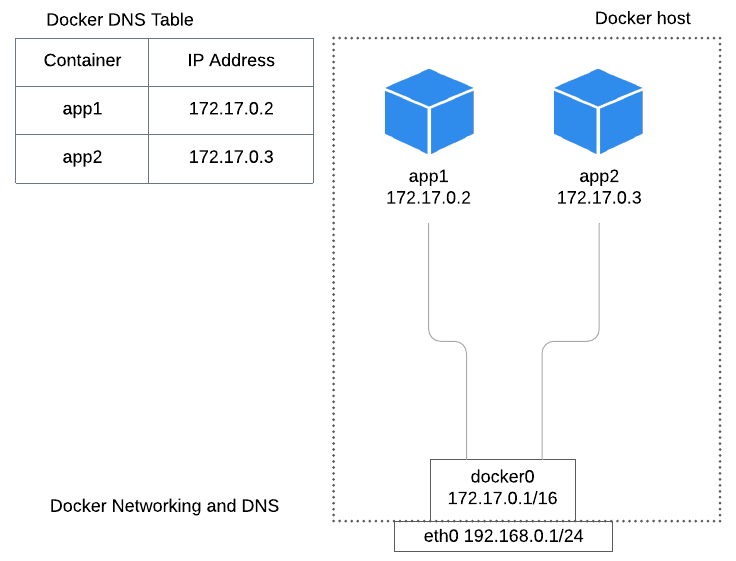

## PART 1 - Build and Run application with Docker image and container

### Prerequisites

Have account on hub.docker.com.
We'll use this account later for pushing docker images to a docker registry.

### Build application image

```buildoutcfg
# build image described in Dockerfile
docker image build -t nodejs-app:blue .

# build image and override built-time variable
docker image build --build-arg API_VER=v2 -t nodejs-app:blue .

# verify image is available locally
docker image ls

# observe all docker layers that make up the image
docker image history nodejs-app:blue
```
More about docker build at: https://docs.docker.com/engine/reference/commandline/build/

### Run and check your application container

```buildoutcfg
# run nodejs app on 8080 locahost port from local image
docker container run --publish 8080:8080 --detach --name nodejs-app nodejs-app:blue

# get a prompt inside the container and do some checks
docker exec -ti nodejs-app sh

# get PID of running processes inside container
docker container top nodejs-app

# check these processes are running on localhost
ps u PID

# monitor resource usage
docker container stats --no-stream

# check application is running on port 80080
sudo netstat -tapnl | grep 8080

# access application
curl localhost:8080

# check application logs on container
docker container logs nodejs -f
```

### Pass environment variables to your container

```
# pass environment variable at run time with the ‘-e’ flag:
docker container run --publish 8080:8080 --detach -e DEBUG=1 --name nodejs-app nodejs-app:blue

# pass multiple environment variables from an external file with the ‘env_file’ option
docker container run --publish 8080:8080 --detach --env-file=db.env --name nodejs-app nodejs-app:blue
```
More on this at: https://docs.docker.com/compose/environment-variables/#pass-environment-variables-to-containers

### Data persistency

Because containers are ephemeral and immutable, and we have to redeploy them every time there is a change in our application, the data inside the container isn’t persisted across container removals unless it’s in a data volume or a bind mount.
Data volume - stores data outside container’s unified file system (UFS)
Bind mount - maps localhost path to a container path

Named data volume demo:
```
# build application with name data volume
docker container run -p 8080:8080 -d -v app-data:/app/data --name nodejs-app nodejs-app:blue

# check data volume 
docker volume ls
docker volume inspect app-data
[
    {
        "CreatedAt": "2020-03-25T07:20:10Z",
        "Mountpoint": "/var/lib/docker/volumes/app-data/_data",
        "Name": "app-data",
    }
]

# create a file inside container's data volume
docker exec -ti nodejs-app touch /app/data/file1.txt

# check file is available outside container
sudo ls -larth /var/lib/docker/volumes/app-data/_data

# remove container to show data volume is persistent
docker container rm -f nodejs-app

# create a new container for our application and verify data is persistent across container removals
docker container run -ti --rm -v app-data:/app/data --name nodejs-app2 nodejs-app:blue ls /app/data
```

Bind mount is useful when doing development:
```
# build application with bind mount
cd nodejs-simple-app
docker container run -p 8080:8080 -d -v $(pwd):/usr/src/app --name nodejs-app nodejs-app:blue

# check no volume is created
docker volume ls

# create a new file in current directory, then verify if the new file is also available inside the container
```
More on docker volumes: https://docs.docker.com/storage/volumes/

### Docker networking
* Docker provides networking access to containers via a bridge interface on the Docker host.
* Default bridge subnet 172.17.0.0/16 and Gateway 172.17.0.1/16.
* Docker daemon effectively acts as a DHCP server for each container.
* Each network also has a default subnet mask and gateway.
* A container’s name defaults to be the container’s DNS name in Docker.

```
# create containers
docker container run -d --name app1 nodejs-app:blue
docker container run -d --name app2 nodejs-app:blue

# create network new-net and attach containers to it
docker network create new-net
docker network connect new-net app1
docker network connect new-net app2

# verify network new-net has containers attached
docker network inspect new-net

# verify DNS resolution
docker exec -ti app1 ping app2

# disconnect containers from new-net
docker network disconnect new-net app1
docker network disconnect new-net app2

# verify DNS resolution in default/bridge network. Shouldn't work
docker exec -ti app1 ping app2
```
More on Docker networking:
https://docs.docker.com/config/containers/container-networking/
https://docs.docker.com/network/network-tutorial-host/

### Share Docker image
```buildoutcfg
# tag image for DockerHub registry
docker image tag nodejs-app:blue andreistefanciprian/nodejs-app:blue

# authenticate to dockerhub
docker login -u andreistefanciprian

# push image to DockerHub registry
docker image push andreistefanciprian/nodejs-app:blue

# delete container and container image
docker container rm -f nodejs-app
docker image rm nodejs-app:blue andreistefanciprian/nodejs-app:blue

# run nodejs app on 8080 locahost port from DockerHub image
docker container run --publish 8080:8080 --detach --name nodejs-app andreistefanciprian/nodejs-app:blue

# you can repeat test checks in previous section to verify your container runs as expected
```

### Commands and arguments
Both CMD and ENTRYPOINT instructions define what command gets executed when running a container. 
There are few rules that describe their cooperation:
* Dockerfile should specify at least one of CMD or ENTRYPOINT commands.
* ENTRYPOINT should be defined when using the container as an executable.
* CMD should be used as a way of defining default arguments for an ENTRYPOINT command or for executing an ad-hoc command in a container.
* There can only be one CMD instruction in a Dockerfile. If you list more than one CMD then only the last CMD will take effect.
* CMD will be overridden when running the container with alternative arguments.
* ENTRYPOINT can be overridden when running container with --entrypoint flag

Note: If CMD is used to provide default arguments for the ENTRYPOINT instruction, both the CMD and ENTRYPOINT instructions should be specified with the JSON array format.

```
cat << EOF > Dockerfile
FROM ubuntu
ENTRYPOINT ["sleep"]
CMD ["30"]
EOF

# build image
docker image build -t ubuntu:sleep .

# run container with default entrypoint and command argument
docker container run -d --name ubuntu ubuntu:sleep

# overwrite command argument (CMD)
docker container run -d --name ubuntu ubuntu:sleep 60

# run container with different entrypoint and command argument
docker container run -d --name ubuntu --entrypoint ls ubuntu:sleep -larth
docker container logs ubuntu

# do the same thing in kubernetes
kubectl run ubuntu --image ubuntu:sleep --restart Never --image-pull-policy IfNotPresent
kubectl run ubuntu --image ubuntu:sleep --restart Never --image-pull-policy IfNotPresent 100
kubectl run ubuntu --image ubuntu:sleep --restart Never --image-pull-policy IfNotPresent --command ls -- -larth
kubectl logs ubuntu
```
More about commands and arguments:
https://docs.docker.com/engine/reference/builder/#cmd
https://docs.docker.com/engine/reference/builder/#entrypoint


### Docker Compose
Replacing docker run, build and create commands with a yaml file that’s easy to read and document.
Usually used for multi container applications.
 
In this docker-compose file we're passing environment variables to compose. 
There are many ways to deal with this in compose: https://docs.docker.com/compose/environment-variables/
* You can set default values for any environment variables referenced in the Compose file, or used to configure Compose, in an environment file named .env. You can print to the terminal the resolved output of the compose file with the docker-compose config command.
* The .env file can be overwritten by variables defined in shell
* Environment variables can also be passed to your container via env_file field

Start/Stop application with docker compose:
```
# build application with docker compose
docker-compose up --build -d
 
# Values in the shell take precedence over those specified in the .env file:
IMAGE_TAG=orange \
DB_HOST=2.2.2.2 \
docker-compose up -d
 
# stop application with docker compose
docker-compose down
```

More about the ‘key: value’ options inside docker compose file at: https://docs.docker.com/compose/compose-file/

### Run node tests
```
docker container run -p 8080:8080 --name nodejs-app nodejs-app:blue test
```


