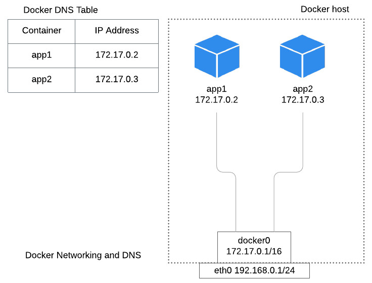

## PART 1 - Build and Run Application with Docker

### Prerequisites
- Create an account on [hub.docker.com](https://hub.docker.com/). You'll need this to push images to a Docker registry later.

---

### Build Container Image
```sh
# Build image from Dockerfile
docker image build -t nodejs-app:blue .

# Build image and override build-time variable
docker image build --build-arg API_VER=v2 -t nodejs-app:blue .

# List local images
docker image ls

# Show all layers of the image
docker image history nodejs-app:blue
```
> **Note:** `<missing>` lines in the history output mean those layers were built elsewhere.

More: [docker build docs](https://docs.docker.com/engine/reference/commandline/build/)

---

### Run and Check Your Application Container
An image becomes a container when you run it.
```sh
# Run app on localhost:8080 from local image
docker container run --publish 8080:8080 --detach --name nodejs-app nodejs-app:blue

# Get a shell inside the container
docker exec -ti nodejs-app sh

# List running processes in the container
docker container top nodejs-app

# Check processes on localhost
ps u <PID>

# Monitor resource usage
docker container stats --no-stream

# Check app is running on port 8080
sudo netstat -tapnl | grep 8080

# Access the app
curl localhost:8080

# View container logs
docker container logs nodejs-app -f
```

---

### Pass Environment Variables to Your Container
```sh
# Pass env variable at run time
docker container run --publish 8080:8080 --detach -e DEBUG=1 --name nodejs-app nodejs-app:blue

# Pass multiple env variables from a file
docker container run --publish 8080:8080 --detach --env-file=db.env --name nodejs-app nodejs-app:blue
```
More: [Passing env vars](https://docs.docker.com/compose/environment-variables/#pass-environment-variables-to-containers)

---

### Data Persistency
Containers are ephemeral. Use **data volumes** or **bind mounts** to persist data.

#### Named Data Volume Example
```sh
# Run app with named data volume
docker container run -p 8080:8080 -d -v app-data:/app/data --name nodejs-app nodejs-app:blue

# List and inspect volumes
docker volume ls
docker volume inspect app-data

# Create a file in the data volume
docker exec -ti nodejs-app touch /app/data/file1.txt

# Check file outside container
sudo ls -larth /var/lib/docker/volumes/app-data/_data

# Remove container (data persists)
docker container rm -f nodejs-app

# Start new container, verify data persists
docker container run -ti --rm -v app-data:/app/data --name nodejs-app2 nodejs-app:blue ls /app/data
```

#### Bind Mount Example (for development)
```sh
cd nodejs-simple-app
docker container run -p 8080:8080 -d -v $(pwd):/usr/src/app --name nodejs-app nodejs-app:blue

docker volume ls
# Create a file in your project dir, check it's in the container
```
More: [Docker volumes](https://docs.docker.com/storage/volumes/)

---

### Docker Networking
- Docker uses a bridge interface for container networking.
- Default subnet: 172.17.0.0/16, Gateway: 172.17.0.1
- Each container gets a DNS name matching its container name.



```sh
# Create containers
docker container run -d --name app1 nodejs-app:blue
docker container run -d --name app2 nodejs-app:blue

# Create and connect to a new network
docker network create new-net
docker network connect new-net app1
docker network connect new-net app2

docker network inspect new-net

docker exec -ti app1 ping app2

docker network disconnect new-net app1
docker network disconnect new-net app2

docker exec -ti app1 ping app2  # Should fail now
```
More: [Container networking](https://docs.docker.com/config/containers/container-networking/)

---

### Share Docker Image
```sh
# Tag image for DockerHub
docker image tag nodejs-app:blue andreistefanciprian/nodejs-app:blue

# Login to DockerHub
docker login -u andreistefanciprian

# Push image
docker image push andreistefanciprian/nodejs-app:blue

# Remove container and image
docker container rm -f nodejs-app
docker image rm nodejs-app:blue andreistefanciprian/nodejs-app:blue

# Run app from DockerHub image
docker container run --publish 8080:8080 --detach --name nodejs-app andreistefanciprian/nodejs-app:blue
```

---

### Commands and Arguments
- `CMD` and `ENTRYPOINT` define what runs in a container.
- Only one `CMD` per Dockerfile (last one wins).
- `CMD` is overridden by arguments at run.
- `ENTRYPOINT` is overridden with `--entrypoint` flag.
- Use JSON array format if combining `CMD` and `ENTRYPOINT`.

Example:
```Dockerfile
FROM ubuntu
ENTRYPOINT ["sleep"]
CMD ["30"]
```
```sh
# Build and run
docker image build -t ubuntu:sleep .
docker container run -d --name ubuntu ubuntu:sleep

docker container run -d --name ubuntu ubuntu:sleep 60

docker container run -d --name ubuntu --entrypoint ls ubuntu:sleep -larth
docker container logs ubuntu
```
Kubernetes equivalent:
```sh
kubectl run ubuntu --image ubuntu:sleep --restart Never --image-pull-policy IfNotPresent
kubectl run ubuntu --image ubuntu:sleep --restart Never --image-pull-policy IfNotPresent 100
kubectl run ubuntu --image ubuntu:sleep --restart Never --image-pull-policy IfNotPresent --command ls -- -larth
kubectl logs ubuntu
```
More: [CMD](https://docs.docker.com/engine/reference/builder/#cmd), [ENTRYPOINT](https://docs.docker.com/engine/reference/builder/#entrypoint)

---

### Docker Compose
Docker Compose replaces `docker run`, `build`, and `create` commands with a simple YAML file. Great for multi-container apps.

- Set default env vars in a `.env` file. Shell vars override `.env`.
- Use `env_file` to pass env vars to containers.
- See resolved config: `docker-compose config`

```sh
# Build and start app
docker-compose up --build -d

# Override env vars in shell
IMAGE_TAG=orange \
DB_HOST=2.2.2.2 \
docker-compose up -d

# Stop app
docker-compose down
```
More: [Compose file options](https://docs.docker.com/compose/compose-file/)

---

### Run Node Tests
```sh
docker container run -p 8080:8080 --name nodejs-app nodejs-app:blue test
```


